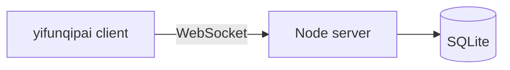

# Terminal card games (qipai)

[中文说明](./README.md)

Play Shaanxi mahjong and “ten-and-a-half” in a terminal: a WebSocket server plus the TUI client `yifunqipai`.

Players install the client from npm and point it at **your** server. Current npm package `@yifunxxx/qipai-cli` version: **0.1.7**.

## Play

Requires Node.js ≥ 20 and a running server.

```bash
npm i -g @yifunxxx/qipai-cli
yifunqipai config set serverUrl ws://YOUR_HOST:8787
yifunqipai
```

Already installed? Update to the latest:

```bash
npm i -g @yifunxxx/qipai-cli@latest
```

Use `wss://YOUR_DOMAIN` behind HTTPS. Optional: `yifunqipai config set username NICK`. Config file: `~/.yifunqipai/config.json`.

Log in with a display name (names need not be unique; identity is the session). A new connection for the same session kicks the old one. Press `o` in the lobby to log out and enter a new name. After 24 hours with no activity (including keepalive), the session is deleted and rooms it hosted are dissolved.

| Context | Keys |
|---------|------|
| Lobby | `1` mahjong vs 3 bots / `2` ten-and-a-half free-for-all / `3` banker mode / `j` join (6-digit room id) / `r` refresh / `o` log out |
| Room | `c` config / `y` `u` ready / `b` add bot / `d` remove bot / `t` transfer host / `k` kick / `s` start / `Enter` chat / `l` leave / `o` log out |
| Mahjong | `←` `→` select, Space lock then discard; `p` pong `g` meld kong `h` hu `a` concealed kong `b` add kong `n` pass; `Enter` chat `Esc` leave chat |
| Ten-and-a-half | `h` hit `s` stand; `Enter` chat `Esc` leave chat |
| Always | `q` quit |

## Layout

```text
packages/
  shared/   # protocol, tiles, rules
  server/   # HTTP /health + WebSocket + SQLite
  client/   # TUI, npm package @yifunxxx/qipai-cli
```



## Start the server from source

HTTP and WebSocket share one port (default **8787**). `GET /health` is the only HTTP route; all gameplay is WebSocket. State lives in SQLite (default `data/qipai.db`).

### Requirements

- **Node.js 22** (built-in `node:sqlite` with `--experimental-sqlite`)
- [pnpm](https://pnpm.io/) 9 (`packageManager` is pinned to 9.15.0)
- Do not use GitHub Actions as the production game host

Same steps on Windows, macOS, and Linux. If 8787 is taken, change `PORT`.

### Development (TypeScript via tsx)

From the repo root:

```bash
pnpm install
pnpm dev:server
```

Same as:

```bash
pnpm --filter @yifun/qipai-server dev
```

You should see:

```text
[qipai-server] http+ws on :8787 data=.../data
```

In another terminal:

```bash
pnpm dev:client
```

The client defaults to `ws://127.0.0.1:8787`.

### Production (build, then run)

```bash
pnpm install
pnpm --filter @yifun/qipai-shared build
pnpm --filter @yifun/qipai-server build
pnpm start:server
```

`start:server` runs:

```bash
node --experimental-sqlite packages/server/dist/index.js
```

(Inside the server package: `node --experimental-sqlite dist/index.js`.)

### Environment variables

See `.env.example`. The process reads the environment; it does not auto-load a `.env` file.

| Variable | Default | Meaning |
|----------|---------|---------|
| `PORT` | `8787` | HTTP + WebSocket listen port |
| `DATA_DIR` | `./data` | Directory for `qipai.db` |
| `SESSION_TTL_MS` | `86400000` | Idle session timeout: delete the session and rooms it hosted after 24h with no activity |

PowerShell:

```powershell
$env:PORT="8787"
$env:DATA_DIR="D:\qipai-data"
pnpm start:server
```

bash:

```bash
PORT=9000 DATA_DIR=/var/lib/qipai pnpm start:server
```

### Health check

```bash
curl http://127.0.0.1:8787/health
```

Expect JSON like `{"ok":true,"ts":...}`. If it fails: process down, wrong port, firewall, or you used the wrong host. `server.listen(PORT)` accepts connections on all interfaces.

Local client:

```bash
yifunqipai config set serverUrl ws://127.0.0.1:8787
yifunqipai
```

LAN players replace `127.0.0.1` with your LAN IP. For the public internet, open `PORT` on the router / cloud security group.

### Troubleshooting

- **`EADDRINUSE`**: 8787 is in use. Stop the old Node process or change `PORT`.
- **SQLite / experimental**: Node 22 and `--experimental-sqlite` are required. Do not drop that flag from the start script.
- **Client connects then drops**: `serverUrl` must be `ws://` (not `http://`). Reverse proxies must allow WebSocket upgrades.

## Deploy the server with Docker

The repo root has `Dockerfile` and `docker-compose.yml`. Image is **Node 22**, runs as a non-root user, writes SQLite under `/data`.

### 1. Install Docker

Install [Docker Desktop](https://docs.docker.com/get-docker/) (Windows / macOS) or Docker Engine + the Compose plugin on Linux. Check:

```bash
docker version
docker compose version
```

Older installs may have `docker-compose` (hyphen). Use that instead of `docker compose` in the commands below.

### 2. Build and run in the background

From the repo root (the directory with `docker-compose.yml`):

```bash
docker compose up -d --build
```

- `--build` rebuilds from current sources
- `-d` detaches

Status and logs:

```bash
docker compose ps
docker compose logs -f qipai-server
```

Logs should include `http+ws on :8787`. Health:

```bash
curl http://127.0.0.1:8787/health
```

Local client:

```bash
yifunqipai config set serverUrl ws://127.0.0.1:8787
yifunqipai
```

### 3. Ports, data, restart

Defaults in `docker-compose.yml`:

- Host `8787` → container `8787`
- `PORT=8787`, `DATA_DIR=/data`, `SESSION_TTL_MS=86400000`
- Named volume `qipai-data` → `/data` (SQLite survives container recreation)
- `restart: unless-stopped` (starts after reboot unless you `stop` it)

Map a different host port (e.g. 9000):

```yaml
ports:
  - "9000:8787"
```

Then the client uses `ws://HOST:9000`. Leave container `PORT` at 8787 unless you also change the image env.

### 4. Day-to-day commands

```bash
# Stop (keep the volume)
docker compose stop

# Remove containers (keep qipai-data)
docker compose down

# Remove containers and wipe the database
docker compose down -v

# Rebuild after code changes
docker compose up -d --build
```

### 5. `docker run` without Compose

```bash
docker build -t qipai-server .
docker run -d --name qipai-server --restart unless-stopped \
  -p 8787:8787 \
  -e PORT=8787 \
  -e DATA_DIR=/data \
  -v qipai-data:/data \
  qipai-server
```

On PowerShell, use `` ` `` instead of `\` for line continuation.

### 6. Cloud / public access

1. Open TCP `8787` (or your mapped host port) in the firewall / security group.
2. Clients use `ws://PUBLIC_IP:8787`.
3. For HTTPS, put Nginx or Caddy in front and use `wss://DOMAIN` (proxy must support WebSocket Upgrade).

### 7. Image notes

Multi-stage build: compile `@yifun/qipai-shared` and `@yifun/qipai-server`, then ship production deps and `dist` only. `HEALTHCHECK` hits `http://127.0.0.1:$PORT/health` inside the container.

## Develop the client too

```bash
pnpm install
pnpm build
pnpm test
pnpm typecheck
```

## Rules (short)

**Shaanxi mahjong:** 112 tiles (characters/dots/bamboo + red dragons, not wild) or 144; pong/kong/hu, no chow; kongs settle immediately; dealer extras; winner becomes dealer, draw keeps dealer.

**Ten-and-a-half:** A=1, J/Q/K=0.5; five dragons beat 10.5; free-for-all or banker vs players.

## License

[MIT](./LICENSE)
