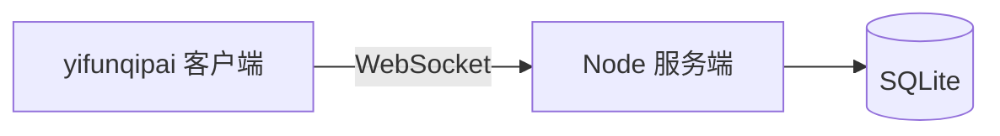

# 终端棋牌大厅

[English](./README.en.md)

终端里玩的陕西麻将和十点半：WebSocket 服务端 + TUI 客户端 `yifunqipai`。

玩家用 npm 安装客户端，连到你部署的服务器即可。当前客户端 npm 包 `@yifunxxx/qipai-cli` 版本：**0.1.4**。

## 玩家怎么用

需要 Node.js ≥ 20，以及一个已经启动的服务端。

```bash
npm i -g @yifunxxx/qipai-cli
yifunqipai config set serverUrl ws://你的服务器:8787
yifunqipai
```

HTTPS 反代时用 `wss://你的域名`。可选：`yifunqipai config set username 昵称`。配置文件：`~/.yifunqipai/config.json`。

进入后输入昵称登录（可重名，身份以会话为准）。同一账号新连接会顶掉旧连接。

| 场景 | 按键 |
|------|------|
| 大厅 | `1` 麻将三人机 / `2` 十点半通比 / `3` 打庄 / `j` 加入 / `r` 刷新 |
| 房间 | `c` 配置 / `y` `u` 准备 / `b` 加人机 / `d` 移除人机 / `t` 转让房主 / `s` 开始 / `l` 离开 |
| 麻将 | `←` `→` 选牌，空格锁定再出牌；`p` 碰 `g` 明杠 `h` 胡 `a` 暗杠 `b` 补杠 `n` 过 |
| 十点半 | `h` 要牌 `s` 停牌 |
| 全局 | `q` 退出 |

## 仓库结构

```text
packages/
  shared/   # 协议、牌面、规则
  server/   # HTTP /health + WebSocket + SQLite
  client/   # TUI，npm 包 @yifunxxx/qipai-cli
```



## 如何启动服务端（源码）

服务端和客户端走同一个 WebSocket 端口（默认 **8787**）：HTTP 只提供 `GET /health`，对局全在 WebSocket 上。数据存在 SQLite（默认 `data/qipai.db`）。

### 环境要求

- **Node.js 22**（使用内置 `node:sqlite`，启动参数 `--experimental-sqlite`）
- [pnpm](https://pnpm.io/) 9（`packageManager` 已锁定 9.15.0）
- 不要用 GitHub Actions 当生产服

Windows / macOS / Linux 步骤相同。若 8787 已被占用，换端口（见环境变量）。

### 开发模式（改代码即跑）

在仓库根目录：

```bash
pnpm install
pnpm dev:server
```

等价于：

```bash
pnpm --filter @yifun/qipai-server dev
```

成功时终端会出现类似：

```text
[qipai-server] http+ws on :8787 data=.../data
```

另开一个终端跑客户端：

```bash
pnpm dev:client
```

客户端默认连接 `ws://127.0.0.1:8787`。

### 生产模式（先编译再跑）

```bash
pnpm install
pnpm --filter @yifun/qipai-shared build
pnpm --filter @yifun/qipai-server build
pnpm start:server
```

`start:server` 会执行：

```bash
node --experimental-sqlite packages/server/dist/index.js
```

（在 filter 包内则是 `node --experimental-sqlite dist/index.js`。）

### 环境变量

可复制 `.env.example` 作参考。当前进程直接读环境变量（未强制加载 `.env` 文件）。

| 变量 | 默认 | 说明 |
|------|------|------|
| `PORT` | `8787` | HTTP + WebSocket 监听端口 |
| `DATA_DIR` | `./data` | 目录下写入 `qipai.db` |
| `SESSION_TTL_MS` | `86400000` | 登录会话有效期，默认 24 小时 |

PowerShell 示例：

```powershell
$env:PORT="8787"
$env:DATA_DIR="D:\qipai-data"
pnpm start:server
```

bash 示例：

```bash
PORT=9000 DATA_DIR=/var/lib/qipai pnpm start:server
```

### 确认服务已起来

```bash
curl http://127.0.0.1:8787/health
```

正常返回 JSON，例如 `{"ok":true,"ts":...}`。网页打开该地址也可以。连不上时检查：进程是否还在、端口是否写对、防火墙是否拦截、是否绑在 `127.0.0.1` 导致局域网连不上（本服务 `listen(PORT)` 默认接受所有网卡）。

本机互连：

```bash
yifunqipai config set serverUrl ws://127.0.0.1:8787
yifunqipai
```

局域网其他人把 `127.0.0.1` 换成你电脑的局域网 IP。公网需要路由器/云安全组放行 `PORT`。

### 常见问题

- **`EADDRINUSE`**：8787 被占用。关掉旧的 `node` 进程，或改 `PORT`。
- **SQLite / experimental**：必须用 Node 22，且带 `--experimental-sqlite`。不要删掉 start 脚本里的这个参数。
- **客户端连上立刻断开**：核对 `serverUrl` 是 `ws://` 不是 `http://`；反代要开 WebSocket 升级。

## 如何用 Docker 部署服务端

仓库根目录已有 `Dockerfile` 和 `docker-compose.yml`。镜像基于 **Node 22**，以非 root 用户运行，数据写在卷 `/data`。

### 1. 安装 Docker

安装 [Docker Desktop](https://docs.docker.com/get-docker/)（Windows / macOS）或 Linux 上的 Docker Engine + Compose 插件。确认：

```bash
docker version
docker compose version
```

旧版可能是 `docker-compose`（带连字符），把下面命令里的 `docker compose` 换成 `docker-compose` 即可。

### 2. 构建并后台启动

在仓库根目录（有 `docker-compose.yml` 的那一层）：

```bash
docker compose up -d --build
```

- `--build`：用当前代码构建镜像
- `-d`：后台运行

查看状态：

```bash
docker compose ps
docker compose logs -f qipai-server
```

日志里应有 `http+ws on :8787`。健康检查：

```bash
curl http://127.0.0.1:8787/health
```

本机客户端：

```bash
yifunqipai config set serverUrl ws://127.0.0.1:8787
yifunqipai
```

### 3. 端口、数据、重启策略

`docker-compose.yml` 默认：

- 主机 `8787` → 容器 `8787`
- 环境变量 `PORT=8787`、`DATA_DIR=/data`、`SESSION_TTL_MS=86400000`
- 命名卷 `qipai-data` 挂到 `/data`（SQLite 持久化，删容器不会丢库）
- `restart: unless-stopped`：机器重启后会拉起，除非你手动 `stop`

改宿主机端口（例如 9000）：

```yaml
ports:
  - "9000:8787"
```

客户端则写 `ws://主机:9000`。容器内仍听 8787，一般不用改 `PORT`。

### 4. 常用运维命令

```bash
# 停止（保留数据卷）
docker compose stop

# 停止并删除容器（仍保留 qipai-data 卷）
docker compose down

# 停止并删除容器和数据（大厅/对局存档会清空）
docker compose down -v

# 更新代码后重新构建
docker compose up -d --build
```

### 5. 只用 docker、不用 compose

```bash
docker build -t qipai-server .
docker run -d --name qipai-server --restart unless-stopped `
  -p 8787:8787 `
  -e PORT=8787 `
  -e DATA_DIR=/data `
  -v qipai-data:/data `
  qipai-server
```

bash 把 `` ` `` 换成 `\`。

### 6. 云主机 / 公网

1. 安全组、防火墙放行 TCP `8787`（或你映射的宿主机端口）。
2. 客户端填写 `ws://公网IP:8787`。
3. 若用 Nginx/Caddy 做 HTTPS，客户端改用 `wss://域名`，反代必须支持 WebSocket（Upgrade）。

### 7. Docker 构建说明

多阶段构建：先编译 `@yifun/qipai-shared` 与 `@yifun/qipai-server`，运行阶段只带生产依赖和 `dist`。`HEALTHCHECK` 请求容器内 `http://127.0.0.1:$PORT/health`。

## 本地开发（同时改客户端）

```bash
pnpm install
pnpm build
pnpm test
pnpm typecheck
```

## 玩法摘要

**陕西麻将：** 112（万筒条+红中，非万能）或 144；可碰/杠/胡，不可吃；杠当场结算；庄家相关翻倍；赢家坐庄，流局连庄。

**十点半：** A=1，J/Q/K=0.5；五龙 > 十点半；通比或打庄。

## 许可

[MIT](./LICENSE)
